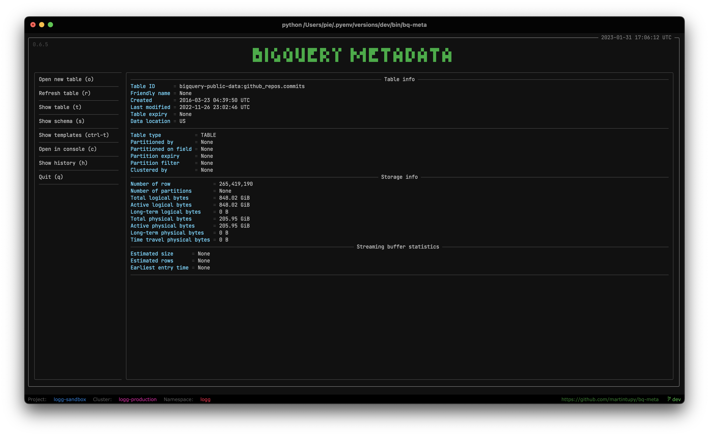

# BigQuery metadata viewer

> "Inspect BigQuery metadata faster"

- quick search through available projects, dataset, tables
- view table metadata and schema
- open in browser

## Requirements

- python >= 3.6

- fzf - https://github.com/junegunn/fzf (required)

```bash
brew install fzf
```

search through list of values (i.e. project, dataset, tables) is done using `fzf`

## Installation

1. Install as python package using [pypi](https://pypi.org/project/bq-meta/), this will create executable in `/usr/local/bin/bq-meta`

    ```bash
    pip install bq-meta
    ```

2. Initialize `bq-meta`

    ```bash
    bq-meta --init
    ```

3. Follow on screen prompts

    - create configuration
    - login to the google account using browser (Account is separated from `gcloud` cli)

## Examples

```bash
Usage: bq-meta [OPTIONS] [FULL_TABLE_ID]

  BiqQuery table metadata viewer

Options:
  -p, --project-id TEXT  Project name
  -d, --dataset-id TEXT  Dataset name
  -t, --table-id TEXT    Table name
  -h, --history          Show history of past searched tables
  --raw                  View raw response from the BigQuery in json format
  --init                 Initialize 'bq-meta' configuration
  --info                 Print info of currently used account
  --fetch-projects       Fetch google projects
  --version              Show the version and exit.
  --help                 Show this message and exit.
```

### Table metadata

To view table metadata, run `bq-meta` and follow through selection of

- project_id
- dataset_id
- table_id

Or directly run bq-meta with full_table_id

```bash
bq-meta bigquery-public-data:github_repos.commits
```



Table metadata can be refreshed, press `r` to fetch fresh metadata, `bq-meta` will be running until any other key is pressed

### Table schema

Once table metadata is opened, press `s` key


### Open in browser

Same for opening in browser, after viewing table metadata press `o` key and table will opened in Google cloud console.


### Search history

Every viewed metadata is saved to the history. To search through history, run `bq-meta --history` / `bq-meta -h` and view same table again

